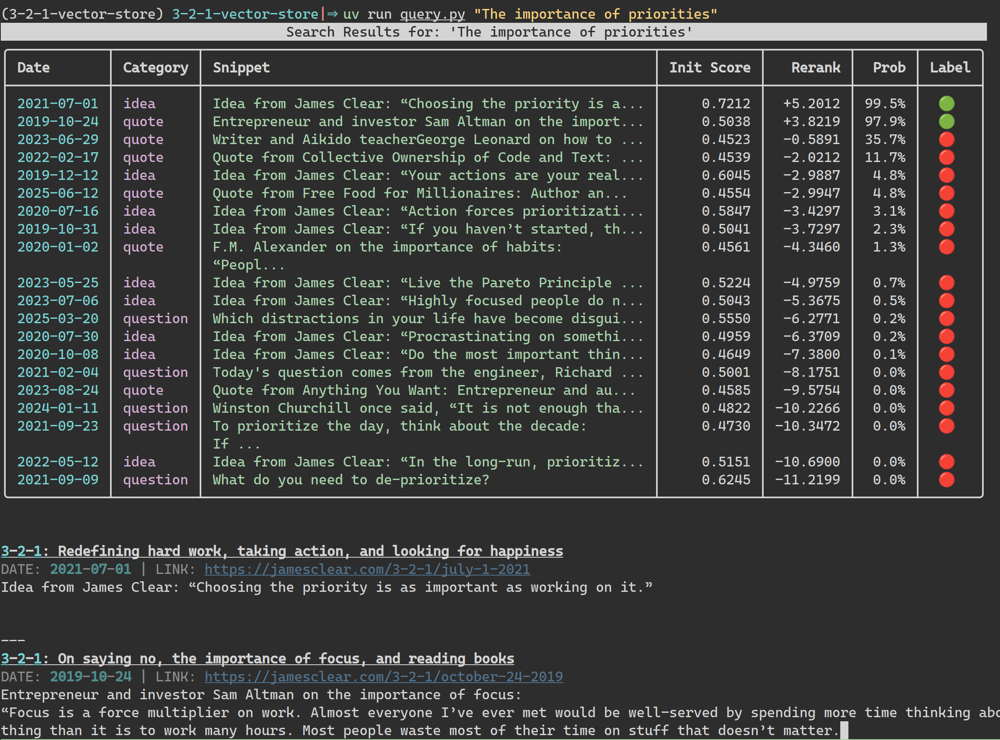
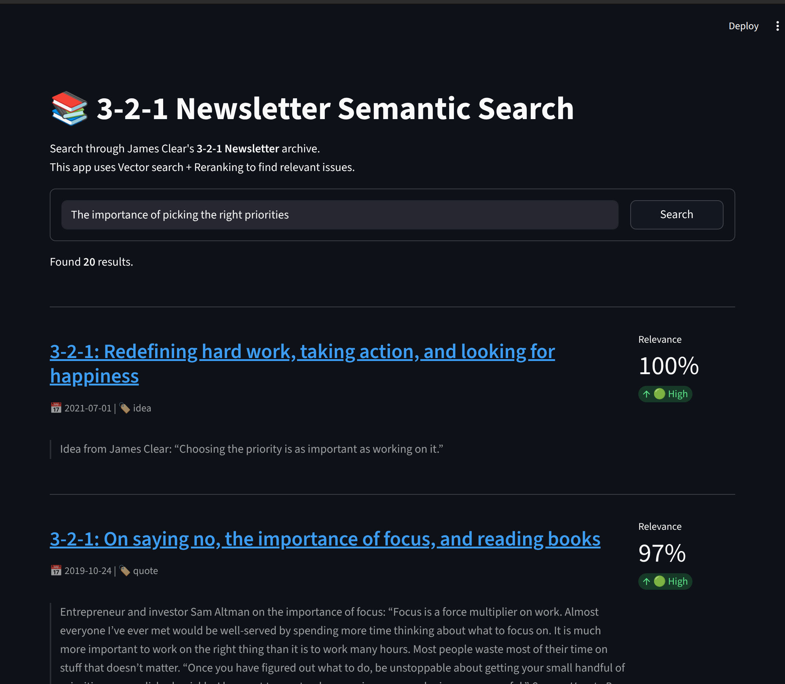

<div align="center">

# 3-2-1 Vector Store

Vector search through issues of the [3-2-1](https://jamesclear.com/3-2-1) newsletter by James Clear

</div>

## Intro

**3-2-1 by James Clear** is by far my favorite newsletter. It is sent out every Thursday and it features:
- **3 ideas** from James
- **2 quotes** from others
- **1 question** for the reader

As it has been going on for years we index its winsdom into a Vector Store for semantic search.

## Installation

```sh
uv sync
```

Then activate the virtual environment:

```sh
source .venv/bin/activate
```

## Data Pipeline

The `dagster` command is used to manage ingestion jobs from the command line.

Alternativelly to visualize and launch them from your browser run `dagster dev` and go [here](http://localhost:3000).

### 1. Pull Newsletter Issues

Launch the download job from command line:

```sh
dagster job execute -m pipeline.definitions -j download_pipeline
```

This will download all issues in HTML format to `data/raw/html`. With a 1-3s delay between requests it will take around 10 minutes.

### 2. Transform, Encode and Store

After downloading all issues in HTML format this job will:
- Covert them to markdown
- Prepare and text data and split it into chunks
- Encode the documents into 384-long embedding vectors with `all-MiniLM-L6-v2`
- Store each document with vector and payload into Qdrant

Before running the pipeline run a local instance of Qdrant with
```sh
docker run -p 6333:6333 qdrant/qdrant
```

Then launch the processing job
```sh
dagster job execute -m pipeline.definitions -j full_processing_pipeline
```

## Query

Once the ingestion pipeline successfully completed it is possible to query the vector store.

### Query Structure
The query will:
- Encode the user question to a vector using the same encoder we used for the data (`all-MiniLM-L6-v2`)
- Query the vector store for nearest vectors using dot distance as we previously normalized embeddings during encoding
- Rerank each of the results together with the user question with `ms-marco-MiniLM-L-6-v2` cross-encoder
- Present the results sorted by this new score

### CLI

From the command line use the `query.py` script to target the docker instance of Qdrant which we previously loaded data into.

```sh
uv run query.py "The importance of priorites"
```





### Web UI

From the web browser launch the Streamlit `app.py`. This will use an in memory version of Qdrant seeded directly from the Parquet file.

```sh
uv run streamlit run app.py
```




